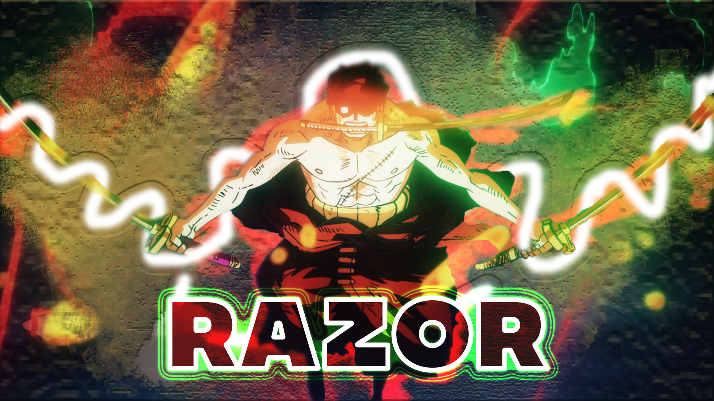

# 💫 About Me:
🧟‍♂️I'm Rafid Hilmi, an Informatics student at Padang State University.  
👀I'm passionate about technology, anime, and manga. As an introvert, I find my creativity in coding and designing solutions to real-world problems.  

 

## 🌐 Socials:
   

# 💻 Tech Stack:
             

# 📊 GitHub Stats:

### ✍️ Random Dev Quote

---

